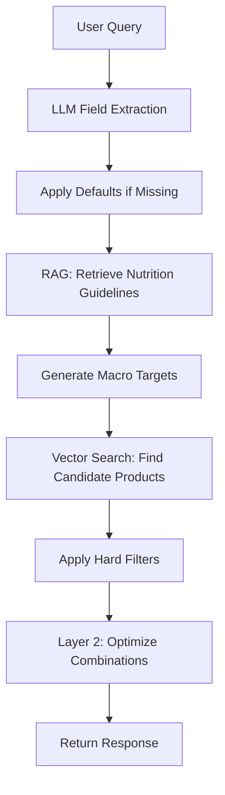

# OA Recs - AI-Powered Snack Recommendation System

A nutrition recommendation system that provides personalized snack suggestions based on user demographics, workout type, and dietary preferences! Built with AI-powered field extraction, RAG-based nutrition guidelines, and multi-layer optimization algorithms.

## Table of Contents

-   [What This App Does](#-what-this-app-does)
-   [Tech Stack](#️-tech-stack)
-   [System Flow Overview](#-system-flow-overview)
-   [Detailed Implementation](#️-detailed-implementation)
-   [Getting Started](#-getting-started)

---

## What This App Does

OA Recs uses an intelligent recommendation system that:

-   **Analyzes user context** (age, weight, exercise type, duration) to generate personalized macronutrient targets to hit
-   **Extracts preferences** from natural language using OpenAI's LLM
-   **Retrieves nutrition guidelines** using RAG (Retrieval-Augmented Generation) with metadata-based filtering
-   **Recommends optimal snack combinations** using vector search and dynamic programming optimization
-   **Provides detailed nutrition breakdowns** with timing recommendations (pre/during/post workout)

**Example**: _"I'm a 25-year-old, 150 pound athlete doing 90-minute strength training. I want savory, high-protein snacks under 400 calories."_ → Returns personalized macro targets and optimized snack combinations.

---

## Tech Stack

### **Backend**

-   **FastAPI** - High-performance Python web framework
-   **SQLAlchemy** - Database ORM with PostgreSQL
-   **OpenAI GPT-4o-mini** - LLM for natural language field extraction
-   **LangChain + ChromaDB** - RAG pipeline for nutrition guidelines
-   **Sentence Transformers** - Vector embeddings for semantic search
-   **Pydantic** - Data validation and serialization

### **Frontend**

-   **Next.js 15** - React framework with server-side rendering
-   **TailwindCSS** - Utility-first CSS framework
-   **Framer Motion** - Animation library
-   **TypeScript** - Type-safe JavaScript

### **AI/ML Components**

-   **Vector Search** - Product matching using `all-MiniLM-L6-v2` embeddings
-   **RAG System** - Knowledge retrieval from nutrition guidelines
-   **LLM Field Extraction** - Structured data extraction from natural language
-   **PyTorch** - Deep learning framework powering sentence transformers

### **How Components Work Together**

```
Frontend (Next.js) ←→ FastAPI Backend ←→ SQLite Database
                           ↓
                    AI Processing Layer
                   ┌─────────────────┐
                   │ OpenAI LLM      │ → Field Extraction
                   │ RAG Pipeline    │ → Guideline Retrieval
                   │ Vector Search   │ → Product Matching
                   │ Optimization    │ → Bundle Creation
                   └─────────────────┘
```

---

## System Flow Overview

### **High-Level Flow: User Query → Recommendations**



### **Key Processing Steps**

1. **Field Extraction** - Parse natural language into structured data
2. **Guideline Retrieval** - Get relevant knowledge documents via RAG
3. **Macro Calculation** - Generate personalized nutrition targets
4. **Product Filtering** - Find matching snacks using vector search
5. **Optimization** - Create optimal combinations using dynamic programming
6. **Response Assembly** - Return detailed recommendations with reasoning

---

## Detailed Implementation

### **Step 1: LLM Field Extraction & Defaults**

**Purpose**: Convert natural language queries into structured data

**Implementation**:

```python
# Location: app/core/macro_targeting_local.py
def extract_fields_from_query(self, user_query: str) -> Dict[str, Any]:
    # Uses OpenAI GPT-4o-mini to extract:
    # - Demographics (age, weight)
    # - Activity (exercise type, duration)
    # - Preferences (flavor, texture, dietary)
    # - Constraints (allergens, calorie limits)
```

**Default Values Applied**:

-   Age: 21 → maps to `age19-59` guidelines
-   Exercise: "cardio" → ensures consistent matching
-   Duration: 60 minutes → "long" session type
-   Weight: 70kg → baseline for calculations

---

### **Step 2: RAG-Based Knowledge Document Retrieval**

**Purpose**: Get expert nutrition advice based on user demographics and activity

**Implementation**:

```python
# Metadata-based exact matching (preferred)
def retrieve_context_by_metadata(self, user_input: UserInput) -> str:
    age_group = map_age_to_group(user_input.age)  # "age19-59"
    exercise_type = get_exercise_type(user_input.exercise_type)  # "strength"
    duration_type = get_duration_type(user_input.duration)  # "long"

    # Direct file access: nutrition_guidelines/age19-59/strength_long_session_19-59.md
    return get_guideline_file(age_group, exercise_type, duration_type)
```

**Guideline Structure**:

```yaml
---
type_of_activity: strength
duration: long
age_group: 19-59
---
timing:
pre:
    carbs_g_per_kg: [0.5, 0.8]
    protein_g_per_kg: [0.1, 0.15]

key_principles:
    - Post-workout carb + protein combination supports muscle repair
    - Hydration and electrolyte replacement important in long sessions
```

**Component Interactions**:

-   **ChromaDB** stores embedded guidelines
-   **YAML Parser** extracts structured nutrition data from retrieved guidelines
-   **Metadata Mapping** ensures exact guideline matching

---

### **Step 3: Personalized Macro Target Generation**

**Purpose**: Calculate precise nutrition targets based on user profile and guidelines

**Implementation**:

```python
# Location: app/core/macro_targeting_local.py
def _extract_macro_values_from_context(self, context: str, user_input: UserInput):
    # Parse YAML nutrition guidelines
    # Apply user weight as multiplier
    # Calculate timing-specific breakdowns (pre/during/post)

    pre_protein = pre_protein_per_kg * user_input.weight_kg
    total_protein = pre_protein + during_protein + post_protein
```

**Calculation Flow**:

1. **Parse Guidelines** - Extract ranges from YAML (e.g., `[0.5, 0.8]` carbs per kg)
2. **Apply Weight Multiplier** - Scale by user's body weight
3. **Duration Adjustment** - Modify for exercise length
4. **Timing Breakdown** - Split into pre/during/post workout phases

**Component Interactions**:

-   **YAML Parser** → Nutrition ranges
-   **User Profile** → Weight/duration multipliers
-   **MacroTarget Model** → Database storage

---

### **Step 4: Vector-Based Product Filtering**

**Purpose**: Find snacks that match user preferences and macro needs

**Implementation**:

```python
# Enhanced embedding system (app/core/enhanced_embedding.py)
def generate_user_query_embedding_text(user_query, soft_preferences, macro_targets):
    # Combines: "I want savory chewy snacks" + "needs 25g protein" + "target 200 calories"

def rank_products_by_similarity(user_query, products, soft_preferences, macro_targets):
    # Creates unified vector space for semantic matching
```

**Two-Stage Search**:

1. **Hard Filtering** - Remove products violating dietary constraints
2. **Vector Ranking** - Semantic similarity matching using sentence transformers

**Component Interactions**:

-   **ProductVectorStore** → ChromaDB with product embeddings
-   **SentenceTransformers** → `all-MiniLM-L6-v2` model for embeddings
-   **Enhanced Embedding** → Unified query + product vector space

---

### **Step 5: Dynamic Programming Optimization**

**Purpose**: Find optimal combinations of 4-10 snacks that best match macro targets

**Implementation**:

```python
# Location: app/core/layer2_macro_optimization.py
def optimize_macro_combination(candidate_snacks, macro_targets):
    # Uses dynamic programming with randomization
    # Optimizes for: protein, carbs, fat, electrolytes
    # Constraints: 4-10 snacks, price considerations
    # Returns: Multiple valid combinations, randomly selects one
```

**Algorithm Features**:

-   **Multi-objective optimization** across 4 macro nutrients
-   **Randomization** for variety (prevents always returning same combination)
-   **Price awareness** as secondary optimization factor
-   **Portion flexibility** (0.5x, 1x, 1.5x serving sizes)

**Component Interactions**:

-   **Candidate Products** → From vector search
-   **MacroTargets** → From RAG calculation
-   **CombinationResult** → Optimized bundle with stats

---

### **Step 6: Enhanced Response Assembly**

**Purpose**: Create comprehensive response with all context and reasoning

**Implementation**:

```python
# Location: app/core/recommendation.py
return EnhancedRecommendationResponse(
    recommended_products=response_products,
    macro_targets=macro_target_response,
    timing_breakdown=timing_breakdown,  # Pre/during/post details
    reasoning=reasoning_steps,          # Step-by-step explanation
    user_profile=user_profile,          # Detected/default values
    bundle_stats=bundle_stats,          # Nutritional totals
    preferences=preferences_info,       # Applied filters
    key_principles=key_principles       # Nutrition guidance
)
```

**Response Components**:

-   **Products** - Optimized snack combinations with quantities
-   **Macro Breakdown** - Detailed nutrition with timing
-   **Reasoning Trail** - Transparent decision process
-   **User Context** - Profile used for calculations
-   **Nutrition Principles** - Expert guidance from RAG

---

## 📄 License

This project is licensed under the MIT License - see the [LICENSE](LICENSE) file for details.

---

**Built with ❤️ for personalized nutrition optimization**
